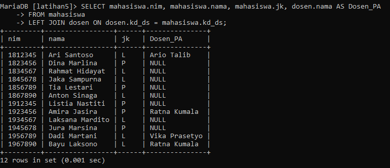

# Praktikum5_SQL_JOIN

## **SQL JOIN**<br>

SQL JOIN adalah operasi yang digunakan untuk menggabungkan baris dari dua atau lebih tabel berdasarkan kondisi yang ditentukan. Dengan menggunakan JOIN, Anda dapat mengambil data yang terkait dari tabel yang berbeda dalam satu query.
ada beberapa jenis JOIN dalam SQL, termasuk:<br>

1. INNER JOIN: Menggambungkan baris dari dua tabel berdasarkan kesamaan nilai kolom yang dijadikan kondisi JOIN. Hanya baris yang memiliki kesamaan nilai dalam kedua tabel yang akan dihasilkan.<br>
2. LEFT JOIN (LEFT OUTER JOIN): Menggambungkan baris dari dua tabel berdasarkan kesamaan nilai dalam kolom yang dijadikan kondisi JOIN. Selain itu, semua beris dari tabel yang di-left join akan tetap ditampilkan, bahkan jika tidak ada kesamaan nilai dalam tabel kanan.<br>
3. RIGHT JOIN (RIGHT OUTER JOIN): Mirip dengan LEFT JOIN, tetapi semua baris dari tabel yang di-right join akan tetap ditampilkan, bahkan jika tidak ada kesamaan nilai dalam tabel kiri.<br>
4. FULL JOIN (FULL OUTER JOIN): Menggabungkan baris dari dua tabel dengan mempertahankan semua baris dari kedua tabel, bahkan jika tidak ada kesamaan nilai. Jika tidak ada kesamaan nilai, kolom untuk tabel yang tidak memiliki nilai akan berisi NULL.<br>
5. CROSS JOIN: Menghasilkan hasil gabungan dari kedua tabel tanpa memerikaa kondisi. Jumlah baris yang dihasilkan akan menjadi perkalian dari jumlah baris pada kedua tabel.<br>

## **LATIHAN**

- Lakukan join table Mahasiswa dan Dosen
- Lakukan join table Matakuliah dan Dosen
- Lakukan join table JadwalMengajar, Dosen, dan Matakuliah
- Lakukan join table KrsMahasiswa, Mahasiswa, Matakuliah dan Dosen

## **TABLE LATIHAN**

- **TABLE mahasiswa**<br>
<br>
- **TABLE dosen**<br>
<br>
- **TABLE matakuliah**<br>
<br>
- **TABLE jadwalmengajar**<br>
<br>
- **TABLE KRSMahasiswa**<br>
<br>

## **LATIHAN PRAKTIKUM**
### **SCRIPT SQL-JOIN and SCREENSHOT**

1. JOIN TABLE Mahasiswa dan Dosen
   ```sql
   SELECT mahasiswa.nim, mahasiswa.nama, mahasiswa.jk, dosen.nama AS Dosen_PA
   FROM mahasiswa
   INNER JOIN dosen ON dosen.kd_ds = mahasiswa.kd_ds;
   ```
   <br>

2. LEFT JOIN TABLE Mahasiswa dan Dosen
   ```sql
   SELECT * mahasiswa.nim, mahasiswa.nama, mahasiswa.jk, dosen.nama AS Dosen_PA
   FROM mahasiswa
   LEFT JOIN dosen ON dosen.kd_ds = mahasiswa.kd_ds;
   ```
   <br>

3. JOIN TABLE Jadwal Mengajar, Dosen dan Matakuliah
   ```sql
   SELECT jadwalmengajar.kd_mk, matakuliah.nama, matakuliah.sks, dosen.nama as Dosen_Pengampu
   FROM jadwalmengajar
   INNER JOIN matakuliah ON jadwalmengajar.kd_mk = matakuliah.kd_mk
   INNER JOIN dosen ON jadwalmengajar.kd_ds = dosen.kd_ds;
   ```
   <br>

4. JOIN TABLE Jadwal Mengajar, Dosen, dan Matakuliah
   ```sql
   SELECT jadwalmengajar.kd_mk, matakuliah.nama, matakuliah.sks, dosen.nama AS 'Dosen Pengampu', jadwalmengajar.hari, jadwalmengajar.jam, jadwalmengajar.ruang
   FROM jadwalmengajar
   INNER JOIN dosen ON jadwalmengajar.kd_ds = dosen.kd_ds
   INNER JOIN matakuliah ON jadwalmengajar.kd_mk = matakuliah.kd_mk;
   ```
   <br>

5. JOIN TABLE KRSMahasiswa, Mahasiswa, Matakuliah dan Dosen
   ```sql
   SELECT KRSMahasiswa.nim, mahasiswa.nama, dosen1.nama AS 'Dosen PA', matakuliah.nama AS Matakuliah, matakuliah.sks, dosen2.nama AS 'Dosen Pengampu'
   FROM KRSMahasiswa
   INNER JOIN mahasiswa ON KRSMahasiswa.nim = mahasiswa.nim
   LEFT JOIN dosen AS dosen1 ON KRSMahasiswa.kd_ds = dosen1.kd_ds
   INNER JOIN matakuliah ON KRSMahasiswa.kd_mk = matakuliah.kd_mk
   LEFT JOIN dosen AS dosen2 ON dosen2.kd_ds = KRSMahasiswa.kd_ds
   ```
   <br>


## **KESIMPULAN**

1. Join antara tabel "Mahasiswa" dan "Dosen":
   - Digunakan untuk menghubungkan mahasiswa dengan dosen yang menjadi pembimbingnya.
   - Data yang dihubungkan adalah kolom "kd_ds" pada tabel "Mahasiswa" dan "kd_ds" pada tabel "Dosen".
2. Join antara tabel "Matakuliah" dan "Dosen":
   - Digunakan untuk menghubungkan matakuliah dengan dosen pengajar yang bertanggung jawab.
   - Data yang dihubungkan adalah kolom "kd_ds" pada tabel "Matakuliah" dan "kd_ds" pada tabel "Dosen".
3. Join antara tabel "JadwalMengajar", "Dosen", dan "Matakuliah":
   - Digunakan untuk menghubungkan jadwal mengajar dengan dosen pengajar dan matakuliah yang diajar.
   - Data yang dihubungkan adalah kolom "kd_mk" pada tabel "JadwalMengajar", "kd_ds" pada tabel "JadwalMengajar" dan "Dosen", serta "kd_mk" pada tabel "Matakuliah".
4. Join antara tabel "KRSMahasiswa", "Mahasiswa", "Matakuliah", dan "Dosen":
   - Digunakan untuk menghubungkan KRS (Kartu Rencana Studi) mahasiswa dengan informasi mahasiswa, matakuliah, dan dosen pengajar.
   - Data yang dihubungkan adalah kolom "nim" pada tabel "KRSMahasiswa" dan "Mahasiswa", kolom "kd_mk" pada tabel "KRSMahasiswa" dan "Matakuliah", serta kolom "kd_ds" pada tabel "KRSMahasiswa" dan "Dosen".